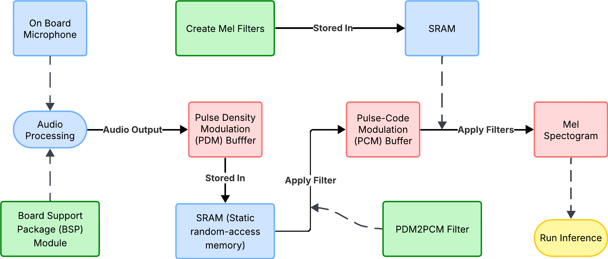

# 🦉 Acoustic Species TinyML Hardware Repository - Burrowing Owl Classifier

This repository contains the embedded hardware implementation for deploying the burrowing owl vocalization classifier on the **STM32H747I-DISCO** development board. The system performs real-time audio capture, signal processing, and on-device inference using a quantized CNN model.

---

## Hardware Setup

### Target Platform

- **Microcontroller**: STM32H747I-DISCO Development Board
- **Audio Input**: On-board MP34DT05-A MEMS Digital Microphone
- **Processing**: Dual-core ARM Cortex-M7 + Cortex-M4

### Key Specifications

- **Audio Sampling**: Real-time PCM audio capture
- **Signal Processing**: Mel spectrogram conversion on-device
- **Inference**: Quantized CNN model execution
- **Memory**: Optimized for embedded constraints

---

## System Architecture

The embedded system consists of three main components:

1. **Audio Capture Module**: Real-time recording from MP34DT05-A MEMS microphone
2. **Signal Processing Module**: PCM buffer to mel spectrogram conversion
3. **Inference Engine**: CNN model execution for owl call classification

---

## Development Environment

### Prerequisites

- **IDE**: STM32CubeIDE
- **SDK**: STM32CubeH7 library and drivers
- **Hardware**: STM32H747I-DISCO development board

### Setup Instructions

1. **Install STM32CubeIDE**

   ```
   Download from STMicroelectronics official website
   ```

2. **Import Project**

   ```
   File → Import → Existing Projects into Workspace
   ```

3. **Build and Flash**
   ```
   Build the project and flash to STM32H747I-DISCO board
   ```

---

## Implementation Status

| Component          | Status      | Description                              |
| ------------------ | ----------- | ---------------------------------------- |
| Audio Capture      | Implemented | Real-time recording from MEMS microphone |
| Signal Processing  | Implemented | PCM to mel spectrogram conversion        |
| CNN Inference      | Implemented | Model execution and classification       |
| System Integration | In Progress | Combining all three components           |

<br>
<br>



---

### Current Capabilities

- **Real-time Audio**: Continuous capture from on-board MEMS microphone
- **Efficient Processing**: On-device mel spectrogram generation
- **Edge Inference**: Quantized CNN model execution
- **Low Latency**: Optimized for real-time performance

---

## Usage

_Note: Full integration is currently in progress. Individual components can be tested separately._

1. **Power on** the STM32H747I-DISCO board
2. **Connect** via STM32CubeIDE for debugging/monitoring
3. **Audio capture** begins automatically from MEMS microphone
4. **Signal processing** converts audio to spectrograms
5. **CNN inference** classifies owl vocalizations in real-time

---

## Technical Details

### Audio Processing

- **Sample Rate**: Configured for optimal owl call detection
- **Buffer Management**: Circular buffering for continuous capture
- **Preprocessing**: Real-time mel spectrogram computation

### Model Deployment

- **Format**: Quantized model optimized for STM32
- **Memory Usage**: Minimized for embedded constraints
- **Inference Time**: Optimized for real-time performance

---

## Integration with Software Team

This hardware implementation is designed to work with models trained by the software team. See the [software repository](link-to-software-repo) for:

- Model training pipelines
- Dataset information (BUOWSET)
- Model architectures (MobileNetV2, ProxylessNAS)
- Performance benchmarks

---

## Dependencies

- STM32CubeH7 library
- STM32 HAL drivers
- STM32CubeIDE development environment

---

## Next Steps

- [ ] Complete integration of all three components
- [ ] System testing and optimization
- [ ] Performance benchmarking
- [ ] Field deployment preparation

---

## Authors

- **Reese Whitlock** – B.S. Computer Science, UC San Diego
- **Kruti Dharanipathi** – B.S. Computer Engineering, UC San Diego
- **Ben Scott** – M.S. Computer Science, UC San Diego

---

## License

MIT License. Part of the CSE 145/237D Embedded System Design Project at UC San Diego.
